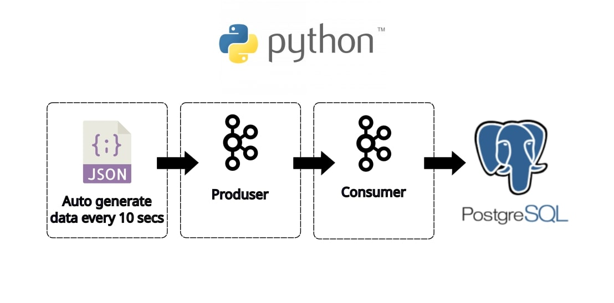

# data_streaming_kafka_postgres

# *Overview*
Project repo to demonstrate data streaming and data consuming using Kafka. Data streamer using auto generate data using python3 code and consuming then importing into PostgreSQL as data lake. This work flow is demonstrate simple data ingestion using streaming method. 
# *Prerequisites*
To follow along this project, below requirement need to be available at your system:
- python3 installed with kafka library
  ```bash
  sudo apt instaal python3
  ```
  ```bash
  pip install kafka
  ```
- kafka running on system
  ```bash
  sudo systemctl status kafka
  ```
- postgresql running on system
  ```bash
  sudo systemctl status postgresql
  ```
# *Project Flow*
Data streaming from kafka to postgresql
1. Prequsition -- running kafka server, provide topic for publish-subcription
   ```bash
   sudo systemctl start kafka
   ```
3. Data streaming -- python3 code to autogenerate json data every 10 sec than publish into kafka
   ```bash
   python3 data_streamer.py
   ```
   ```vim
   import json
   import time
   import random
   from datetime import datetime
   from kafka import KafkaProducer
   from faker import Faker

   # --- Configuration ---
   KAFKA_BROKER = 'localhost:9092'  # Replace with your Kafka broker address
   KAFKA_TOPIC = 'new-events'    # Replace with your desired Kafka topic name
   INTERVAL_SECONDS = 10           # in seconds
   ```
   ```vim
   # Send the JSON data to the Kafka topic
   future = producer.send(KAFKA_TOPIC, value=customer_data)
   record_metadata = future.get(timeout=10) # Block until a result is received, 10s timeout
   ```
5. Data consume
   - python3 code create postgres connection
     ```vim
     import json
     from kafka import KafkaConsumer
     import psycopg2  # PostgreSQL library

     # --- Configuration ---
     KAFKA_BROKER = 'localhost:9092'  # Replace with your Kafka broker address
     KAFKA_TOPIC = 'new-events'      # Replace with your Kafka topic name
     POSTGRES_HOST = 'localhost'     # Replace with your PostgreSQL host
     POSTGRES_DB = 'costumer'   # Replace with your PostgreSQL database name
     POSTGRES_USER = '*****'     # Replace with your PostgreSQL username
     POSTGRES_PASSWORD = '*****' # Replace with your PostgreSQL password
     ```
   - sql query for data insertion
     ```vim
      # Construct the INSERT query
        insert_query = f"INSERT INTO {table_name} ({columns}) VALUES ({values})"
     ```
   - kafka consumer connect to topic
     ```vim
     # Establish a connection to the PostgreSQL database
        conn = psycopg2.connect(
            host=POSTGRES_HOST,
            database=POSTGRES_DB,
            user=POSTGRES_USER,
            password=POSTGRES_PASSWORD
        )
        cur = conn.cursor()
     ```
   - insert consume data to postgres
     ```vim
     # Insert the data into PostgreSQL
       insert_data_to_postgres(customer_data)
     ```

